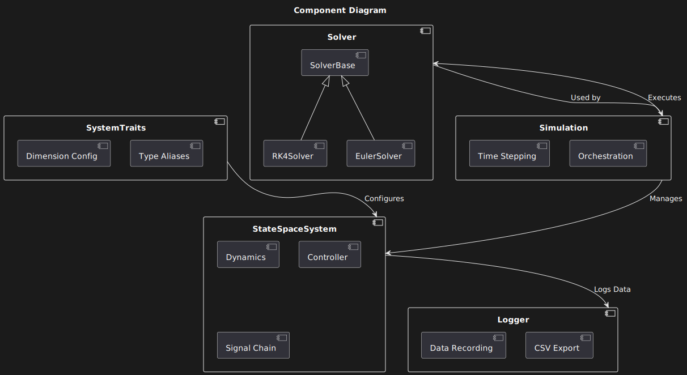
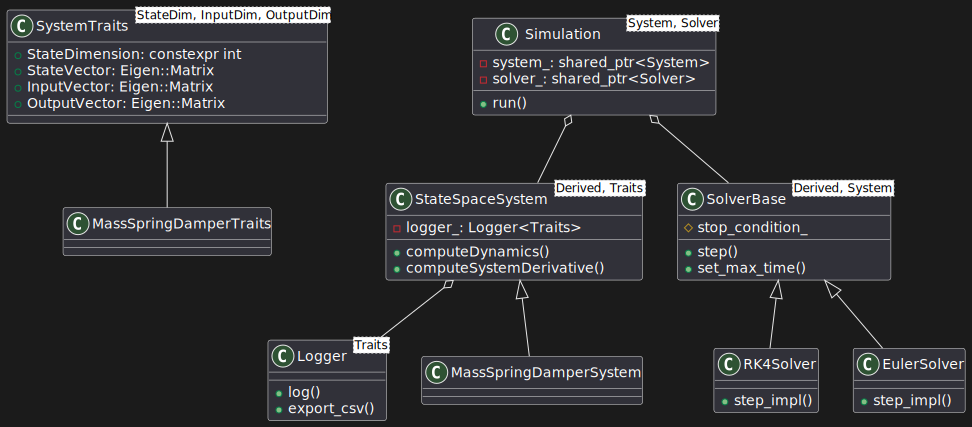
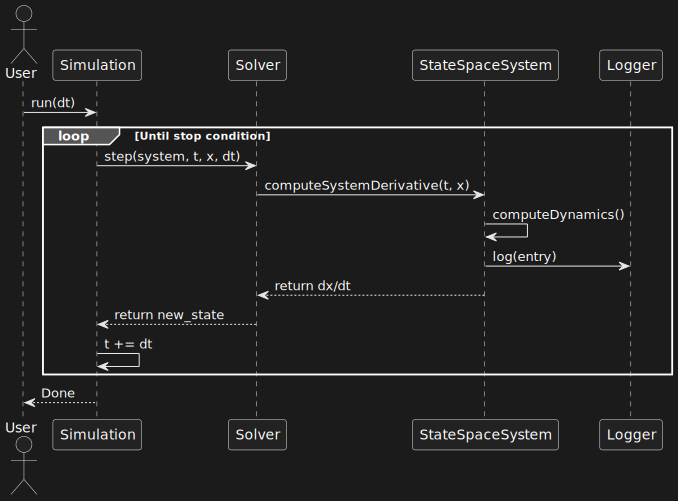
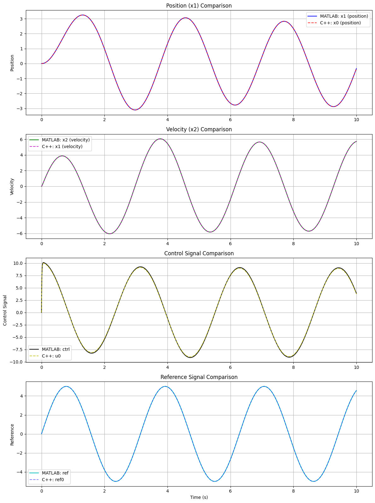

# Control Toolbox 🎛️

[](https://www.gnu.org/licenses/gpl-3.0)
[](https://github.com/ArshiaS07/control-toolbox/actions)

A modern C++ framework for control system simulation and analysis, featuring:
- State-space system modeling 📈
- Multiple numerical solvers (RK4, Euler) 🧮
- MATLAB®-validated results 📊
- Real-time data logging & export 📁

*Note: This project is a work in progress, and many parts were generated with the help of AI to accelerate development. I am learning and refining as I go, so the code may not be perfect.*


## Architecture Overview 🏗️

### Component Diagram

*High-level system organization*

### Class Relationships

*Core class interactions and inheritance*

### Simulation Flow

*Typical simulation execution sequence*

## Quick Start 🚀

### Prerequisites
- C++17 compiler
- CMake 3.15+
- Eigen3

### Installation
```bash
git clone https://github.com/yourusername/control-toolbox.git
cd control-toolbox
mkdir build && cd build
cmake .. -DCMAKE_BUILD_TYPE=Release
cmake --build .
```

## Key Features ✨

### 1. State-Space System Modeling
```cpp
// SPDX-FileCopyrightText: 2024 Your Name
// SPDX-License-Identifier: GPL-3.0-or-later

struct MyTraits : public ControlToolbox::SystemTraits<2, 1, 1> {
    struct Parameters { double m, k, c; };
};
```

### 2. Multiple Solvers
```cpp
auto solver = std::make_shared<ControlToolbox::RK4Solver<MySystem>>();
solver->set_max_time(10.0);
```

### 3. Data Logging & Export
```cpp
system->getLogger().export_csv("simulation_data.csv");
```

## Validation Against MATLAB® ✅


*Position tracking comparison between C++ and MATLAB implementations*

Run validation:
```bash
python validation/scripts/compare_results.py
```

## Examples 📖

Try the included mass-spring-damper system:
```bash
cd build/examples/MassSpringDamper
./MassSpringDamper
```

## Documentation 📘

Build API docs:
```bash
doxygen docs/Doxyfile
```
Open `docs/html/index.html` in your browser.

## Contributing 🤝

We welcome contributions! Please see:
- [CONTRIBUTING.md](CONTRIBUTING.md)
- [Code of Conduct](CODE_OF_CONDUCT.md)

## License 📄

This program is free software: you can redistribute it and/or modify it under the terms of the GNU General Public License as published by the Free Software Foundation, either version 3 of the License, or (at your option) any later version.

See [LICENSE](LICENSE) for full terms, or read [GPLv3 Overview](https://www.gnu.org/licenses/gpl-3.0.en.html).

---
## Control Toolbox Demo 🎥

Check out the included demo to see the framework in action, including system simulation and visualization.

---